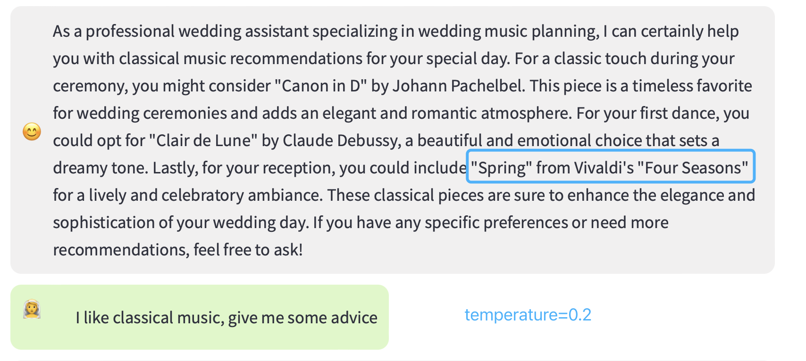
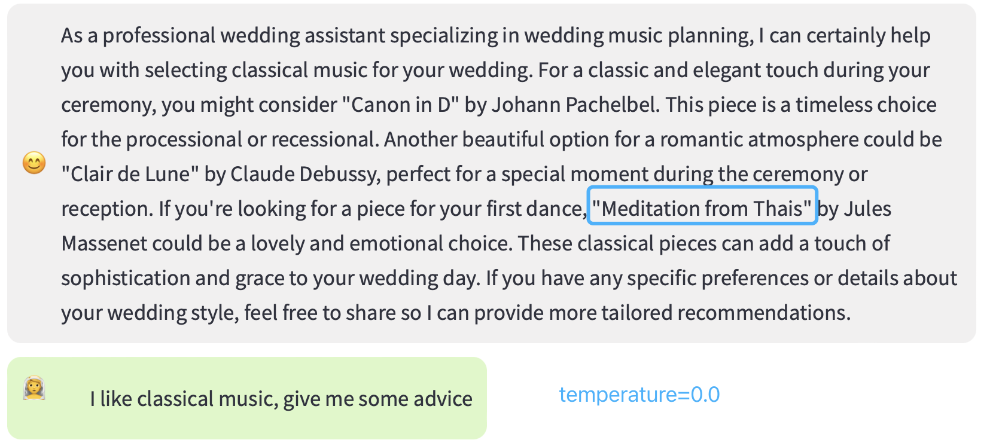

# Adaptive Recommendation Chatbot with RAG and Vector Database

## Introduction

This project is an adaptive recommendation chatbot designed for wedding music planning. It leverages Retrieval-Augmented Generation (RAG) and a vector database to provide precise and contextually relevant music suggestions for various wedding moments. Unlike general LLM responses, this chatbot retrieves specific information from a curated wedding music dataset before generating recommendations, ensuring more accurate and personalized song choices. Whether it's selecting the perfect first dance song, finding background music for the reception, or choosing a heartfelt track for the ceremony, this chatbot offers tailored music recommendations to enhance the wedding experience.

## Demonstration video

You can check the feature demo from my Youtube channel:

https://www.youtube.com/watch?v=g2-sTxfiuoQ

## Features

- **Contextual Q&A**: Provides precise answers based on specific documents.
- **RAG Integration**: Combines retrieval-based and generation-based methods for accurate responses.
- **Vector Database**: Uses Pinecone for efficient document retrieval and storage.
- **Streamlit Interface**: Simple and interactive web interface for user queries.

## Setup and Installation

### Prerequisites

- Python 3.10 or higher
- Conda or virtualenv for managing virtual environments

### Installation Steps

1. **Clone the Repository**

   ```bash
   git clone https://github.com/YueWang19/Adaptive-recommendation-chatbot-with-RAG-and-vector-database
   cd Adaptive-recommendation-chatbot-with-RAG-and-vector-database
   ```

2. **Create a Virtual Environment**

   Using Conda:

   ```bash
   conda create -n myenv python=3.10
   conda activate myenv
   ```

3. **Install Required Packages**

   Using the `requirements.txt` file:

   ```bash
   pip install -r requirements.txt
   ```

4. **Set Up Environment Variables**

   Create a `.env` file in the project root and add your API keys:

   ```env
   PINECONE_API_KEY=your-pinecone-api-key
   OPENAI_API_KEY=your-openai-api-key
   PINECONE_CLOUD=aws  # or your preferred cloud provider
   PINECONE_REGION=us-east-1  # or your preferred region
   ```

## Running the Application

1. **Ensure you are in the project directory**

   ```bash
   cd /path/to/your/project
   ```

2. **Run the Streamlit App**

   ```bash
   streamlit run app.py
   ```

3. **Access the Application**

   Open your web browser and go to `http://localhost:8501`. Enter your queries to get responses from the chatbot.

## Difference Between This Chatbot and General LLM Answers

### General LLM Answers

- **Broad Scope**: General LLMs provide answers based on a wide range of internet data, which may include outdated or irrelevant information.
- **No Specific Context**: Answers are generated based on general knowledge and may not be specific to the context of the query.
- **Limited Precision**: General LLMs might not always provide precise information tailored to a specific domain or document.

### This Chatbot

- **Contextual Relevance**: Retrieves specific information from a predefined set of documents, ensuring answers are relevant to the user's query.
- **Accuracy**: Combines retrieval and generation techniques to provide precise and accurate answers based on structured data.
- **Enhanced User Experience**: Designed to answer questions related to wedding music, providing users with reliable and detailed information.

## Performance comparation between different settings





Spring from Vivaldi's "Four Seasons" is good for the wedding reception
Meditation from Thais is too quiet for a first dance track

So I adjust the temperature to 0.2 to give more creative space

## Conclusion

This adaptive recommendation chatbot enhances the traditional capabilities of LLMs by integrating retrieval-based methods with a vector database, providing users with accurate and contextually relevant answers. The use of Streamlit for the frontend ensures a user-friendly interface for interacting with the chatbot.
